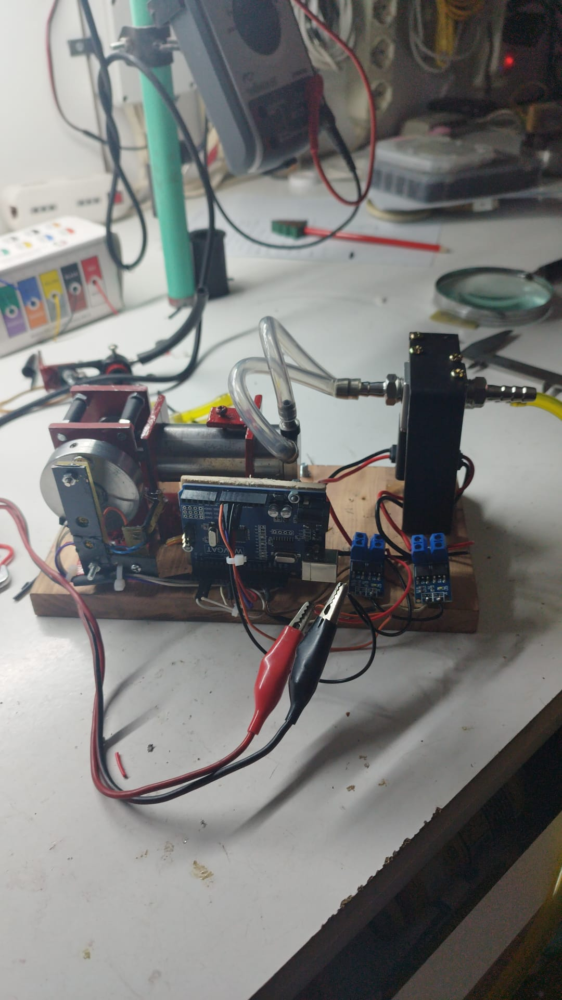
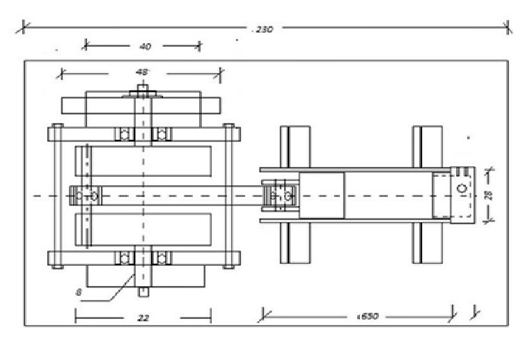

# ⚙️ Motore a Fluido Compresso - Prototipo "Colasanti"

**Progettista:** Gianfranco Colasanti | **Stato:** Prototipo Sperimentale (Proof of Concept)
**Performance raggiunte:** 1200 RPM | **Sistema di controllo:** Arduino Uno

---

### 🚀 1. Descrizione del Progetto: Motore Fluido Elettronico (M.F.E.)

Il progetto M.F.E. nasce dalla necessità di superare i limiti di efficienza dei motori pneumatici a distribuzione meccanica. L'innovazione principale consiste nell'eliminazione totale dell'albero a camme, sostituito da un **sistema di gestione elettronica a fasatura variabile**. 

Arduino decide, in base alla lettura dei sensori, l'istante esatto di immissione e scarico del fluido. Questo permette di eliminare gli attriti meccanici e di ottimizzare il consumo d'aria, risolvendo il problema del "corto circuito pneumatico" (fuoriuscita del fluido prima del lavoro utile).

---

### 🛠️ 2. Architettura Meccanica e Design

Il motore è costruito con materiali ferrosi e alluminio, rifinito al tornio per garantire la massima precisione dei componenti rotanti.

| Componente | Specifiche Tecniche |
| :--- | :--- |
|  | **Cilindro:** Tubo in acciaio da 64 mm, interno **lappato a specchio** per la massima tenuta pneumatica. |
|  | **Pistone:** Alluminio (Ø 28 mm, corsa 15 mm) per ridurre le masse alterne e le inerzie. |
| **Albero Motore** | Costruito in **3 pezzi separati**, assemblati a pressione e bilanciati al tornio. |
| **Biella** | Montata su **2 micro-cuscinetti**, eliminando le resistenze delle bronzine tradizionali. |
| **Testata** | In alluminio con collettori da 3.5 mm e fori filettati passo 5 mm. |
| **Volano:** Realizzato in un **unico blocco di ferro** (diametro 48 mm, spessore 11 mm) per la massima stabilità inerziale |

---

### ⚡ 3. Sistema di Timing ed Elettronica

La distribuzione "Cam-less" è resa possibile da una lettura magnetica della fase:

* **Sensori di Hall (3144):** Posizionati davanti al volano, rilevano il passaggio di **2 magneti al neodimio** (tutti con la stessa polarità).
* **Regolazione Fase:** L'anticipo non è fisso; può essere regolato fisicamente spostando i magneti sul volano per trovare lo "sweet spot" di massima coppia.
* **Logica "Dead Time":** Il software garantisce un ritardo di sicurezza (500 microsecondi) tra la chiusura di una valvola e l'apertura della successiva per massimizzare la pressione utile nel cilindro.

---

📈 3. Analisi dei Risultati e Sviluppo Ibrido

I test condotti sul prototipo alimentato esclusivamente ad aria compressa hanno dato risultati eccellenti in termini di rendimento meccanico e fluidodinamico. Questo dimostra la piena fattibilità del sistema di distribuzione elettronica "Cam-less".

#### Il passaggio al Sistema Ibrido
Nonostante l'alto rendimento, i test sul campo hanno evidenziato un limite fisico: l'autonomia limitata dovuta alla bassa densità energetica dell'aria compressa per un uso pratico esteso (es. su bicicletta).

Per superare questa barriera, il progetto si sta evolvendo verso un **Sistema Ibrido Aria/Combustibile (Gas/Butano)**:

* **Obiettivo:** Utilizzare l'aria compressa non solo come fluido motore, ma come vettore per l'espansione termica.
* **Funzionamento:** L'aggiunta di una fase di combustione (o riscaldamento del fluido) permetterà di aumentare drasticamente il volume e la pressione del gas in ingresso, moltiplicando l'autonomia e la potenza utile senza stravolgere la meccanica attuale.

---
### ⚠️ Avvertenze
Progetto puramente sperimentale. La manipolazione di recipienti in pressione e gas infiammabili richiede competenze specifiche. L'autore declina ogni responsabilità.

### 📜 Proprietà Intellettuale
Opera dell'ingegno di **Gianfranco Colasanti**. Documentazione e codice condivisi esclusivamente per scopi didattici e di ricerca.
---
